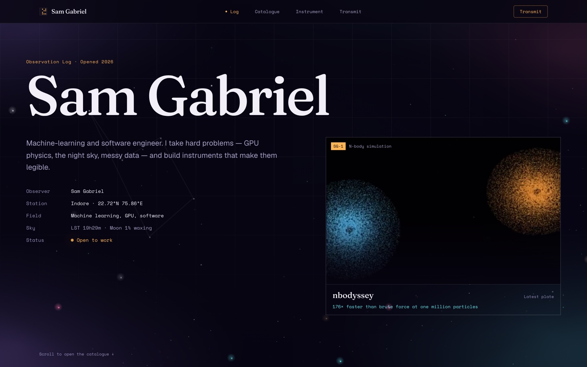
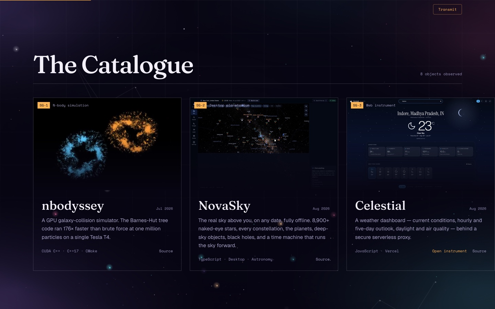

# Observation Log

A single-page portfolio for Sam Gabriel, a machine-learning and software engineer in
Indore, India. It is built as an astronomer's log: projects are objects with catalogue
designations, the skill list is the instrument, work history is the record, and the
contact form is a transmission.

**Live at [samgabriel.vercel.app](https://samgabriel.vercel.app)**, and from
[samgabriel-here.github.io](https://samgabriel-here.github.io).



The readings in that header are computed in the browser from the station coordinates
(22.72°N, 75.86°E), so local sidereal time and the moon phase change while you read the
page. Nothing there is a static string.

## The catalogue

Eight objects, four of them with something you can open and use. Each card carries a
screenshot or a capture of the thing actually running, because a reader cannot clone and
build a CUDA simulator to see whether it works.



The one performance figure on the site is nbodyssey's: the Barnes-Hut tree code ran
176 times faster than brute force at one million particles on a single Tesla T4. It is
the only benchmark quoted and it is not rounded.

## Sections

| Section | What it holds |
| --- | --- |
| Log | Observer, station, field, live sky readout, current status |
| Catalogue | Eight projects, SG-1 to SG-8, with source and live links |
| Instrument | The tools, grouped by what they are for |
| Record | Education and work history |
| Transmit | Contact form, email, and social links |

## Running it

```bash
npm install
npm run dev
```

Then open `http://localhost:3000`.

## Building

```bash
npm run build
```

`next.config.ts` sets `output: "export"` and `images: { unoptimized: true }`, so the build
writes a fully static site to `./out` with no server behind it. That constraint is the
reason the contact form composes a `mailto:` link rather than posting anywhere, and why
the email address and social links stay visible as a fallback.

## Deploying

Two hosts, both from `main`:

- **Vercel** builds and serves `samgabriel.vercel.app` on every push.
- **GitHub Pages** builds the same commit through
  [`.github/workflows/deploy.yml`](.github/workflows/deploy.yml) and serves
  `samgabriel-here.github.io`.

The Pages workflow uploads `./out` as the artifact. If the two hosts ever disagree, one of
them has not rebuilt: check the Actions tab before assuming the source is wrong.

## Stack

Next.js 16 App Router, React 19, TypeScript, Tailwind CSS v4. No runtime server, no
database, no analytics.

## Design and product notes

[`DESIGN.md`](DESIGN.md) records the design system: the palette, the type scale, spacing,
components and their states, and motion. [`PRODUCT.md`](PRODUCT.md) records who the site is
for and the constraints that follow. Read both before changing anything visual.

## Licence

MIT. See [LICENSE](LICENSE).
